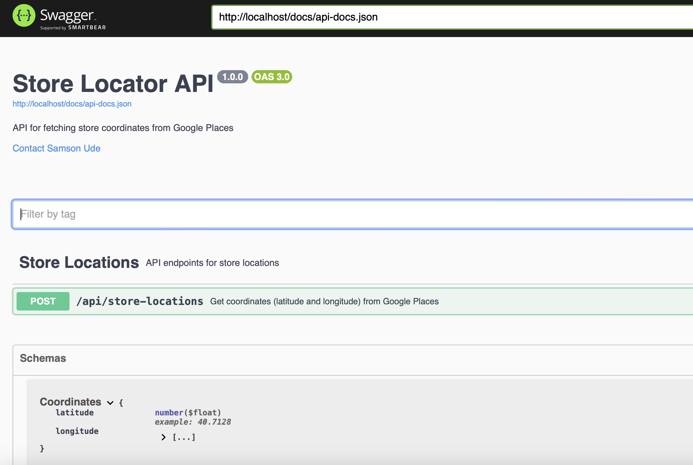
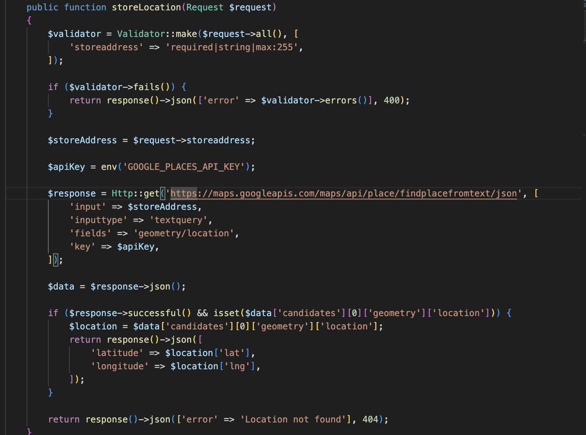
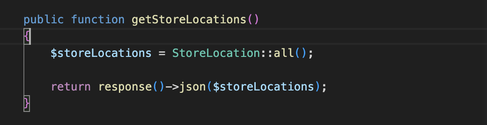
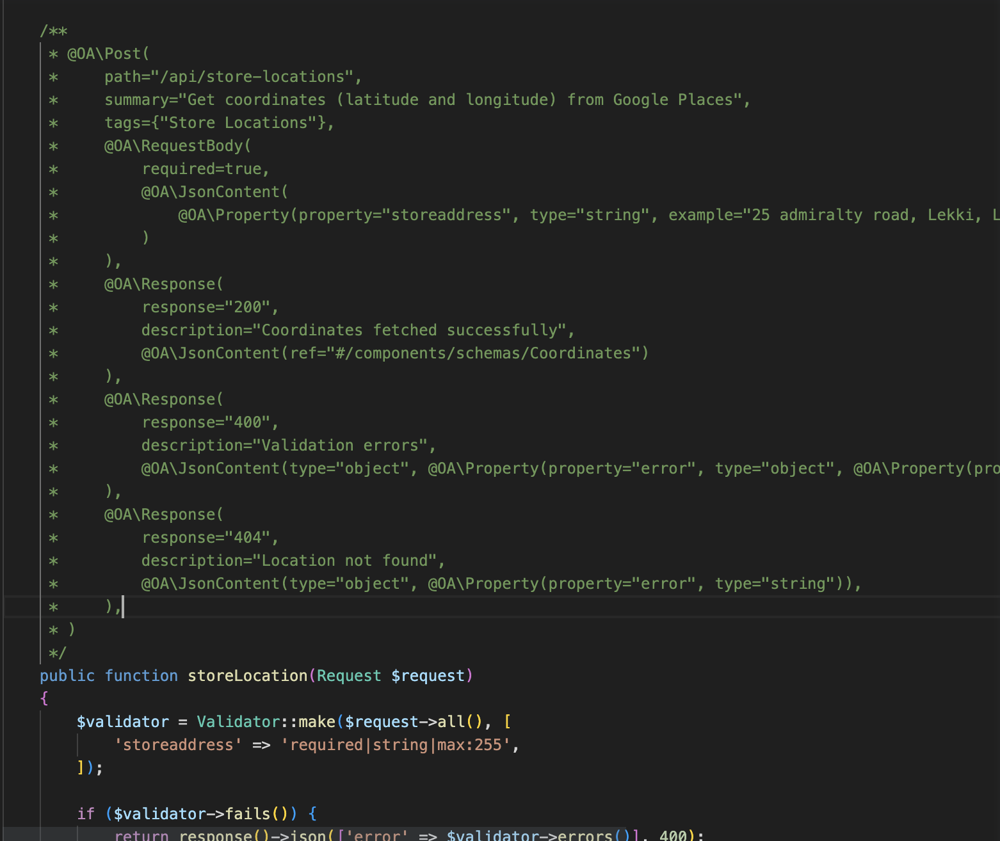

# Store Locator API with Laravel Sail (Docker) and Swagger



## Introduction

In today's fast-paced world, convenience is key. Whether you're a business owner looking to attract and engage customers or a tech enthusiast aiming to simplify everyday tasks, having the ability to quickly locate nearby stores or points of interest is a game-changer. Imagine a user-friendly solution that seamlessly integrates with your application, allowing users to effortlessly find the nearest stores, restaurants, or service centers based on their preferences. This is where a Store Locator API comes into play.

Creating a Laravel API to fetch longitude and latitude from Google Places involves several steps. In this guide, I'll walk you through the process step by step. Before we start, ensure you have Laravel installed and set up on your development environment.

## Getting Started

### Step 1: Set Up a New Laravel Sail Project

If you haven't already created a Laravel project, you can do so using Composer:

```bash
curl -s "https://laravel.build/storelocatorapi" | bash
```

After the project has been created, you can navigate to the application directory and start Laravel Sail. Laravel Sail provides a simple command-line interface for interacting with Laravel's default Docker configuration:

```bash
./vendor/bin/sail up
```

Please make sure you have Docker installed and running

## Step 2: Configure Your .env File

Next, configure your .env file with your Google Places API key. You can obtain an API key by following the instructions on the Google Cloud Platform Console.

```bash
 GOOGLE_PLACES_API_KEY=your_api_key_here
```

### Step 3: Create a Migration and Model

Create a migration and model to represent the store locations:

```bash
 ./vendor/bin/sail php artisan make:model StoreLocation -m
```

-   Edit the migration file to define the table structure in the database/migrations directory. For example:

```bash
public function up()
{
    Schema::create('store_locations', function (Blueprint $table) {
        $table->id();
        $table->string('name');
        $table->string('address');
        $table->decimal('latitude', 10, 7);
        $table->decimal('longitude', 10, 7);
        $table->timestamps();
    });
}

```

-   Then, run the migration to create the store_locations table:

```bash
./vendor/bin/sail php artisan migrate

```

### Step 4: Update the Controller

Modify the Controller.php to handle storing store locations:



### Step 5: Create a Route for Storing Locations

In routes/api.php, add a new route for storing store locations:

```bash
Route::post('/store-locations', [GooglePlacesController::class, 'storeLocation']);


```

## Step 6: Create an API to Get Store Locations

Create an API to retrieve store locations:

```bash
Route::get('/store-locations', [GooglePlacesController::class, 'getStoreLocations']);


```



To document your Laravel API endpoints for the storeLocation and getStoreLocations actions using Swagger documentation, you can follow these additional steps:

### Step 7: Install Laravel Swagger

You'll need to use a package like darkaonline/l5-swagger to generate Swagger documentation for your Laravel API. Install it via Composer:

```bash
./vendor/bin/sail composer require darkaonline/l5-swagger


```

### Step 8: Publish Configuration Files

After installing the package, you need to publish its configuration files:

```bash
./vendor/bin/sail php artisan vendor:publish --provider "L5Swagger\L5SwaggerServiceProvider"


```

This will create a config/l5-swagger.php configuration file.

### Step 9: Annotate Your Controller Methods



### Step 10: Generate Swagger Documentation

```bash
./vendor/bin/sail php artisan l5-swagger:generate
```

-   This command will generate a JSON Swagger documentation file and make it accessible at the specified path, typically /api/documentation.

### Step 11: Access and Test Swagger Documentation

You can access the Swagger documentation in your web browser at http://localhost/api/documentation. Here, you can interactively test your API endpoints, view their documentation, and even export the API definitions in various formats.

## Conclusion

In this blog post, we explored the process of creating a Store Locator API using Laravel, integrating it with the Google Places API, and documenting it with Swagger. This powerful API allows you to store and retrieve store locations, making it easy for users to find the nearest stores based on their preferences.

We started by setting up Laravel and configuring the Google Places API key, ensuring a secure and functional integration. Then, we implemented endpoints to store store location data, call the Google Places API to obtain latitude and longitude coordinates, and retrieve store locations.

To make our API developer-friendly, we used Swagger for documentation. This interactive documentation allows developers to understand the endpoints, request parameters, and response structures, making it easier to integrate the API into their applications.

Remember that this is just the beginning. You can extend this API by adding features such as search, filtering, and user authentication to enhance the user experience.

## External Resources

[Laravel Documentation](https://laravel.com/docs) - Official Laravel documentation to explore more Laravel features. <br/>
[Google Places API Documentation](https://developers.google.com/maps/documentation/places/overview) - Official documentation for Google Places API to learn about its capabilities. <br/>
[Swagger Documentation](https://swagger.io/docs/) - Explore Swagger documentation to dive deeper into API documentation and design.
